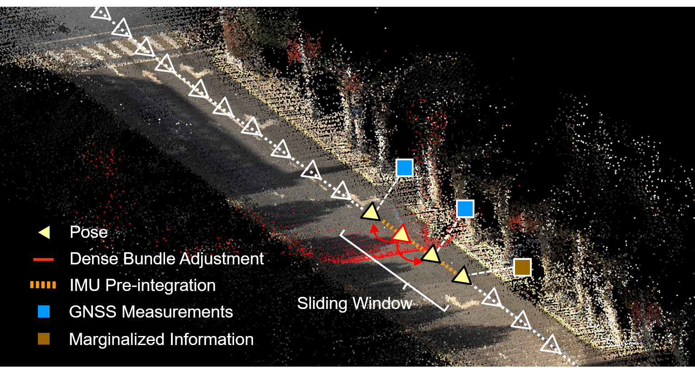
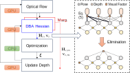
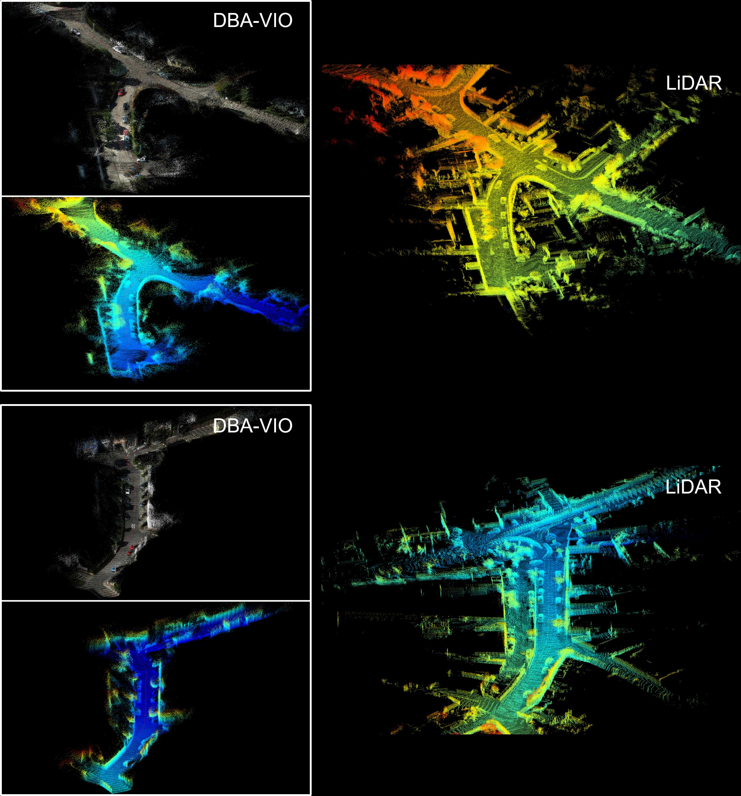
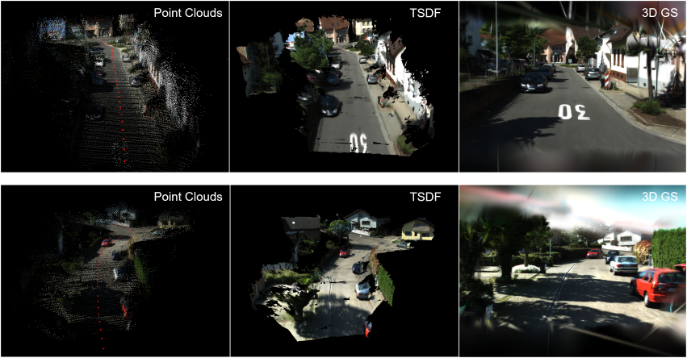

# DBA-Fusion

>Tightly Integrating Deep Dense Visual Bundle Adjustment with Multiple Sensors for Large-Scale  Localization and Mapping


<div align=center>

</div>


[[Paper](https://arxiv.org/abs/2403.13714)] [[Video](https://www.bilibili.com/video/BV1yeNEecEwR/?share_source=copy_web&vd_source=a659a573a520a1151e294d0c8b9c842a)]

## What is this? 

**DBA-Fusion** is basically a VIO system which fuses DROID-SLAM-like dense bundle adjustment (DBA) with classic factor graph optimization. This work enables **realtime metric-scale localization and dense mapping** with excellent accuracy and robustness. Besides, this framework supports the **flexible fusion of multiple sensors** like GNSS or wheel speed sensors, extending its applicability to large-scale scenarios.  
<br />
<div align=center>

</div>
<br />
<div align=center>

</div>
<div align=center>

</div>

## Update log
- [x] Code Upload (2024/02/28)
- [x] Monocular VIO Examples (2024/02/28)
- [x] Multi-sensor data sequence (WUH1012) used in the manuscript is available [here](https://drive.google.com/file/d/1w7UsAwreou_9YRYHz13QIGu6jOJGpdg5/view?usp=sharing).
- [x] Multi-Sensor Fusion Examples 
- [ ] Stereo/RGB-D VIO Support

## Installation
The pipeline of the work is based on python, and the computation part is mainly based on Pytorch (with CUDA) and GTSAM.

Use the following commands to set up the python environment.

```Bash
conda create -n dbaf python=3.10.11
conda activate dbaf
# Other CUDA versions should also be fine.
pip install torch==1.11.0+cu113 torchvision==0.12.0+cu113 torchaudio==0.11.0 --extra-index-url https://download.pytorch.org/whl/cu113
pip install torch-scatter==2.0.9 -f https://data.pyg.org/whl/torch-1.11.0+cu113.html
pip install gdown tqdm numpy==1.25.0 numpy-quaternion==2022.4.3 opencv-python==4.7.0.72 scipy pyparsing matplotlib h5py 
pip install evo --upgrade --no-binary evo
pip install open3d # optional for visualization
```

As for GTSAM, we make some modifications to it to extend the python wrapper APIs, clone it from the following repository and install it under your python environment.

```Bash
git clone https://github.com/yuxuanzhou97/gtsam
cd gtsam
mkdir build
cd build
cmake .. -DGTSAM_BUILD_PYTHON=1 -DGTSAM_PYTHON_VERSION=3.10.11
make python-install
```

Finally, run the following command to build DBA-Fusion.

```Bash
git clone --recurse-submodules https://github.com/GREAT-WHU/DBA-Fusion.git
cd DBA-Fusion
python setup.py install
```

## Run DBA-Fusion
We don't modify the model of DROID-SLAM so you can directly employ the  weight trained for DROID-SLAM. Here we use the [model](https://drive.google.com/file/d/1PpqVt1H4maBa_GbPJp4NwxRsd9jk-elh/view?usp=sharing) pre-trained on TartanAir (provided by [DROID-SLAM](https://github.com/princeton-vl/DROID-SLAM?tab=readme-ov-file)), which shows great zero-shot performance on real-world datasets.

**(Attention!!!)**
For the default configurations, around ~10GB GPU memory is needed. Lower the "max_factors" argument to 36 or lower could help reduce the memory usage to ~6GB.

### 1. TUM-VI
1.1 Download the [TUM-VI](https://cvg.cit.tum.de/data/datasets/visual-inertial-dataset) datasets (512*512).

**(Optional)**
For better speed performance, it is recommended to convert the PNG images to a single HDF5 file through
```Bash
python dataset/tumvi_to_hdf5.py --imagedir=${DATASET_DIR}/dataset-${SEQ}_512_16/mav0/cam0/data --imagestamp=${DATASET_DIR}/dataset-${SEQ}_512_16/mav0/cam0/data.csv --h5path=${SEQ}.h5 --calib=calib/tumvi.txt --stride 4
```

1.2  Specify the data path in [batch_tumvi.py](../batch_tumvi.py) (if you use HDF5 file, activate the "--enable_h5" and "--h5_path" arguments), run the following command 

```Bash
python batch_tumvi.py  # This would trigger demo_vio_tumvi.py automatically.
```

Look into [demo_vio_tumvi.py](../demo_vio_tumvi.py) to learn about the arguments. Data loading and almost all the parameters are specified in this **one** file.

1.3 The outputs of the program includes **a text file** which contains real-time navigation results and **a .pkl file** which contains all keyframe poses and point clouds.

To evaluate the realtime pose estimation performance, run the following command (notice to change the file paths in *evaluate_kitti.py*)

```Bash
python evaluation_scripts/evaluate_tumvi.py --seq ${SEQ}
```
or 
```Bash
python evaluation_scripts/batch_evaluate_tumvi.py
```


For 3D visualization, currently we haven't handled the realtime visualization functionality. Run the scripts in the **"visualization"** folder for post-time visualization. 

```Bash
python visualization/check_reconstruction_tumvi.py
```

### 2. KITTI-360
2.1 Download the [KITTI-360](https://www.cvlibs.net/datasets/kitti-360/index.php) datasets. Notice that we use the **unrectified perspective images** for the evaluation (named like "2013_05_28_drive_XXXX_sync/image_00/data_rgb").


For **IMU** data and IMU-centered **ground-truth poses**, we transform the axises to **Right-Forward-Up (RFU)** and check the synchronization. Besides, we use [OpenVINS](https://github.com/rpng/open_vins/) (in stereo VIO mode) to online refine the Camera-IMU extrinsics and time offsets (whose pre-calibrated values seem not very accurate) on the sequences. The refined parameters are used for for all the tests.  

**To reproduce the results**, just download the our prepared IMU and ground-truth data from [here](https://drive.google.com/file/d/1BO8zGvoey7IdwbWXmAdlhGPr6hiCFJ6Y/view?usp=drive_link), then uncompress it to the data path.

**(Optional)**
Similar to the TUM-VI part, you can use the following script to generate a HDF5 file for best speed performance.

```Bash
python dataset/kitti360_to_hdf5.py --imagedir=${DATASET_DIR}/2013_05_28_drive_%s_sync/image_00/data_rgb --imagestamp=${DATASET_DIR}/2013_05_28_drive_%s_sync/camstamp.txt --h5path=${SEQ}.h5 --calib=calib/kitti360.txt --stride 2
```

2.2 Run the following command

```Bash
python batch_kitti360.py
```
Dataloading and parameters are specified in [demo_vio_kitti360.py](../demo_vio_kitti360.py).

2.3 For evaluation and visualization, run
```Bash
python evaluation_scripts/evaluate_kitti360.py --seq ${SEQ}
python visualization/check_reconstruction_kitti360.py
```

### 3. WUH1012
Download our self-collected data sequence from [here](https://drive.google.com/file/d/1w7UsAwreou_9YRYHz13QIGu6jOJGpdg5/view?usp=sharing).

See [batch_whu.py](../batch_whu.py) for multi-sensor fusion in different modes (VIO + wheel speed/GNSS), as described in the manuscript.

### 4. Run on Your Own Dataset
To run monocular VIO on your own dataset,
* Duplicate a script from [demo_vio_kitti360.py](../demo_vio_kitti360.py) or [demo_vio_tumvi.py](../demo_vio_tumvi.py). 
* In the script, specify the data loading procedure of IMU data and images.
* Specify the camera intrinsics and camera-IMU extrinsics in the script. 
* Try it!

## Some Results
- Visual point cloud map compared to accumulated LiDAR point clouds.
<div align=center>

</div>

- Further processing on the visual point clouds. (P.S. For 3-D GS, the point positions and number are fixed. The training time is around 3 minutes on RTX4080 laptop. )
<div align=center>

</div>

## Acknowledgement
DBA-Fusion is developed by [GREAT](http://igmas.users.sgg.whu.edu.cn/group) (GNSS+ REsearch, Application and Teaching) Group, School of Geodesy and Geomatics, Wuhan University. 

<br/>
<div align=center>

</div>
<br/>
<div align=center>

</div>
<br/>

This work is based on [DROID-SLAM](https://github.com/princeton-vl/DROID-SLAM) and [GTSAM](https://github.com/borglab/gtsam). We use evaluation tools from [evo](https://github.com/MichaelGrupp/evo) and 3D visualization tools from [Open3d](https://github.com/MichaelGrupp/evo).
